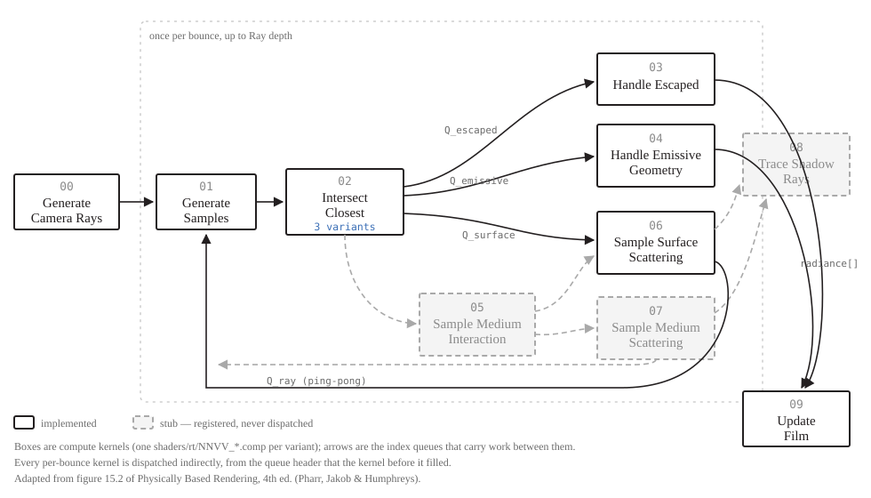

# The raytracer, end to end

*A readable tour of how this renderer traces a ray. For the file-by-file detail an editor needs, see `docs/codebase-map.md` §8.*

---

## 1. The shape of it

The GPU path tracer is a **wavefront** tracer, in the sense Laine, Karras & Aila gave the word in 2013 and that *Physically Based Rendering* 4ed chapter 15 builds on: instead of one big kernel that follows a single ray from the camera until it dies, the work is cut into small kernels, each doing one job for *every* live ray at once, with queues carrying work between them.

The alternative — the **megakernel**, one thread per pixel running the whole algorithm — is the obvious design and it is what the CPU backend does. It falls apart on a GPU because threads execute in lockstep groups. After one bounce, the threads in a group have diverged completely: some rays left the scene, some hit glass, some hit a textured floor. Every branch any of them takes costs *all* of them, so a group of 64 threads can end up doing 64 times the necessary work.

The wavefront fixes this by sorting. Kernel 02 finds each ray's hit and then pushes it onto one of three queues by what it found. Kernel 06 then runs over *only* the rays that hit a scattering surface — so it starts out converged, with every lane genuinely having a BSDF to sample. That is the whole trade: you pay bandwidth (each kernel reads its inputs from memory and writes its outputs back, where a megakernel would keep them in registers) and you buy execution coherence.

```
one frame = 00 → [ 01 → 02 → {03, 04, 06} ] × rayDepth → 09 → tonemap
```

The frame is progressive: each one adds samples to a running per-pixel mean, so the image converges while you watch it and a camera nudge starts it over.

---

## 2. The kernels



The numbering is figure 15.2 of PBR 4ed, and **the directory listing is the diagram**:

```
shaders/rt/
  0001_generate_camera_rays.comp        00
  0101_generate_samples.comp            01
  0201_intersect_closest_bvh.comp       02  ┐
  0202_intersect_closest_cwbvh.comp     02  ├ interchangeable
  0203_intersect_closest_linear.comp    02  ┘
  0301_handle_escaped.comp              03
  0401_handle_emissive.comp             04
  0501_sample_medium_interaction.comp   05  (stub)
  0601_surface_scatter_bsdf.comp        06
  0701_sample_medium_scattering.comp    07  (stub)
  0801_trace_shadow_rays.comp           08  (stub)
  0901_update_film.comp                 09
  include/                              the shared pieces
```

`NNVV` is kernel `NN`, variant `VV`. Slots 05, 07 and 08 have no implementation — there is no participating media and no next-event estimation — but they keep their numbers, carry a stub file that documents what would go there, and have a plan each (`docs/plans/participating-media.md`, `docs/plans/shadow-rays-nee.md`).

| # | Kernel | Runs over | What it does |
|---|---|---|---|
| 00 | Generate camera rays | the whole path pool, once per frame | One primary ray per (pixel, sample) slot, jittered in the pixel and across the aperture |
| 01 | Generate samples | the live ray queue, per bounce | Prepares each path's randomness for this bounce. Where a Sobol sampler would go |
| 02 | Intersect closest | the live ray queue, per bounce | Finds the nearest hit and **sorts** the paths into three queues |
| 03 | Handle escaped | the escaped queue | A ray that left the scene collects the background and ends |
| 04 | Handle emissive geometry | the emissive queue | A ray that hit a light collects its emission and ends |
| 06 | Sample surface scattering | the surface queue | Scatters the path off the surface, or ends it |
| 09 | Update film | the pixels, once per frame | Folds the frame's samples into the running mean |

Then a shared tonemap pass turns the accumulated linear HDR into the rgba8 image the "Raytraced Output" window shows.

### Why the queues hold what they do

Two indexing conventions coexist, and this is the one thing worth holding in your head:

- **`paths[]` and `radiance[]` are indexed by pool slot** — stable for a path's whole life.
- **`hits[]` is indexed by ray-queue position** — compacted, and different every bounce.

The two ray queues (ping-ponging between bounces) hold **path indices**. The three classification queues hold **ray-queue positions**, because that single number is *also* the index of the path's hit record. So kernel 06 pulls one number off its queue and reaches both the hit and the path from it, with no extra indirection. `PathState.radianceSlot` is the bridge back to the pixel.

### How a kernel knows how many threads to launch

It doesn't, and neither does the CPU. Each queue's header is laid out as a `VkDispatchIndirectCommand` with the count appended:

```glsl
struct QueueHeader { uint groupCountX, groupCountY, groupCountZ, rayCount; };
```

The workgroup-aggregated allocator that appends to a queue keeps `groupCountX` equal to `ceil(rayCount / 64)` as it goes — each workgroup adds the number of 64-boundaries its contiguous slice crosses. Every per-bounce kernel is then a `vkCmdDispatchIndirect` reading that header. Nothing is ever read back to the CPU to size a launch, so the compaction is genuinely free. (PBR takes the other route — it over-launches for the maximum and lets surplus threads return immediately — because CUDA launches came from the host there.)

---

## 3. Swapping strategies

This is the part built for experimenting. **Which shader runs in each slot is chosen at runtime**, from the *Windows → Raytracer Shaders* panel, and saved with the scene.

### What exists today

| Slot | Variants |
|---|---|
| 02 Intersect closest | **BVH (binary)** · BVH (compressed 8-wide) · Linear scan (brute force) |
| everything else | one each |

The three traversal variants are the demonstration. They are three files of *six lines each*:

```glsl
#version 460
// 02 Intersect Closest - brute force, no acceleration structure.
#extension GL_GOOGLE_include_directive : require
#include "include/crt_common.glsl"
#include "include/crt_linear.glsl"      // <-- the only line that differs
#include "include/crt_intersect.glsl"
```

Because everything that is *not* the search — classifying the hit, interpolating normals and uvs, writing the record, pushing the queues — lives in `crt_intersect.glsl`, shared unchanged. A strategy file supplies exactly one function:

```glsl
bool traceScene(vec3 origin, vec3 direction, float tMin, float tMax, out TraceHit hit);
```

That is the contract, and it is written down in `include/crt_traverse.glsl` along with the pieces every strategy needs regardless: the hit record, the work counters, the triangle test, the object-space transform.

**Verified:** with a fixed seed, all three strategies produce *bit-identical* images. Swapping the traversal changes the cost and nothing else.

### Adding a fourth traversal

1. Write `include/crt_yourthing.glsl` defining `traceScene()`.
2. Write `shaders/rt/0204_intersect_closest_yourthing.comp` — the six lines above with your include.
3. Add one entry to the table in `src/rt_kernels.cpp`.

Step 3 is where you say which buffers it reads:

```cpp
v.push_back(KernelVariant {
    .slot = KernelSlot::IntersectClosest,
    .id = "yourthing",                 // saved in the scene file; never rename it
    .name = "Your thing",              // what the panel shows
    .description = "...",
    .shader = "rt/0204_intersect_closest_yourthing.comp",
    .domain = KernelDomain::CurrentRayQueue,
    .bindings = intersectBindings(true),
    .settings = KernelSettings::AccelerationStructure,
    .cost = TraversalCost::Acceleration,
});
```

There is no fourth step. The pipeline, its descriptor set layout, its descriptor writes, its dispatch, its panel row and its scene-file entry all come from that one entry.

### How the "which quantities are read and written" problem is solved

The awkward part of swapping shaders is that different shaders want different resources bound. Three approaches were on the table:

- **One fat descriptor set for everything.** What the tracer did before: every stage bound all 18 bindings whether it used them or not. Simple, but every new resource is carried by every kernel forever, and the set becomes a junk drawer.
- **Everything behind buffer device addresses.** Maximally flexible — a new resource is a new pointer field, no descriptor layout anywhere. But it means rewriting every raytracing shader, which was explicitly not the goal.
- **Global binding numbers, per-variant subsets.** What was built.

The binding *numbers* are global and fixed, declared once in `include/crt_common.glsl` and mirrored by the `CrtBinding` enum. But a variant declares which **subset** it uses, and gets a descriptor set layout containing only those numbers. Vulkan is perfectly happy with a layout that has gaps, so:

- The BVH variants list `BlasNodes` and `TlasNodes`. The linear variant doesn't — it never binds them at all.
- Kernel 09 binds three things. Kernel 02 binds nine.
- No existing shader's binding numbers changed, so `crt_common.glsl` stayed a single shared include.

Adding a resource is: a new number at the *end* of `crt_common.glsl`, a matching enumerator at the end of `CrtBinding`, a `case` in `GpuPathTracer::writeSet()`, and listing it in the variants that want it. Existing numbers never move.

### UI that follows the selection

A variant declares what settings it implies, and the rest of the app reacts without knowing which variants those are:

- The **"Acceleration structure" section** of the Raytrace Render panel only appears when the selected 02 variant declares `KernelSettings::AccelerationStructure`. Pick the linear scan and the whole section disappears, because none of it means anything any more.
- The **node layout is no longer a separate control**. It was a combo next to the builder; it is now implied by which 02 variant you picked, because a CWBVH kernel simply cannot read binary nodes. Picking the variant rebuilds the BLASes in the layout it needs.
- The **render guard** asks the variant what a ray costs. A BVH ray costs the scene's SAH — tens of steps. A brute-force ray costs *every primitive in the scene*. That is four orders of magnitude, and it is exactly the case the guard exists for: a linear scan over a million triangles at 1080p once hung this machine's GPU hard enough to take the window server down. Switch kernel 02 to linear on a large model and the Render button refuses until you lower the resolution or accept it explicitly.

### What gets saved

Payload version 8 of the scene file adds:

```json
"kernels": {"00":"thin_lens","01":"pcg_hash","02":"linear","03":"background",
            "04":"direct","05":"none","06":"bsdf","07":"none","08":"none","09":"running_mean"},
"accel":   {"builder":"spatial splits (SBVH)","maxLeafSize":4, ...}
```

Saved **by id, never by index**, so adding or reordering variants later can't silently change what an old scene renders with. An id this build doesn't recognise falls back to the slot's default and reports it as a load warning rather than failing. Every older scene file still opens.

The node layout is deliberately *not* saved — it follows the kernel 02 selection, so storing it would let a file contradict itself.

---

## 4. The maths, kernel by kernel

### 00 — Generate camera rays

A thin-lens camera, precomputed on the CPU as an origin, the lower-left corner of the image plane, its two edge vectors, and the lens basis:

$$P(u,v) = \text{lowerLeft} + u\,\vec{h} + v\,\vec{v}, \qquad \vec{d} = P - (O + r_x \vec{n} + r_y \vec{b})$$

with $(r_x, r_y)$ uniform in a disk of radius aperture/2. The RNG is pure-integer PCG, seeded only from `(pixel, sample index, render seed)` — so a fixed seed reproduces an image exactly regardless of how the queues happened to be ordered or the workgroups scheduled. That determinism is what made the three-way traversal comparison possible.

Every radiance slot is pre-written to zero, with `w` marking whether the slot was spawned at all. A path that later dies silently — absorbed, roulette-killed, out of depth — then contributes exactly zero without writing anything.

### 02 — Intersect closest

**Slab test** for boxes, returning the near distance or ∞:

$$t_{near} = \max_i \min\left(\tfrac{b^{min}_i - o_i}{d_i}, \tfrac{b^{max}_i - o_i}{d_i}\right), \quad t_{far} = \min_i \max(\cdot), \quad \text{hit} \iff t_{near} \le t_{far}$$

Reciprocals replace near-zero components with a signed $10^{-12}$, so no box test forms $0 \times \infty$ — a NaN compares false both ways and would admit or reject a box arbitrarily.

**Möller–Trumbore** for triangles, two-sided, never forming the plane:

$$\begin{bmatrix}t\\u\\v\end{bmatrix} = \frac{1}{(\vec d \times \vec e_2)\cdot \vec e_1}\begin{bmatrix}(\vec t \times \vec e_1)\cdot \vec e_2\\ (\vec d \times \vec e_2)\cdot \vec t\\ (\vec t \times \vec e_1)\cdot \vec d\end{bmatrix}, \quad \vec t = O - v_0$$

**Analytic shapes** (sphere, plane, quad, box, capped cylinder) as unit primitives in object space, with the numerically stable quadratic from *Ray Tracing Gems* ch. 7 — the discriminant taken from the closest-approach vector rather than $|o|^2 - r^2$, which cancels catastrophically for a large sphere seen from close by.

Two details in the two-level structure are worth knowing:

- The object-space ray direction is **deliberately not renormalised**. Since $M(O + t\vec d) = MO + t\,M\vec d$, the parameter $t$ is identical in both spaces, so `tMin`, `tMax` and the running closest hit carry across the transform untouched.
- Normals go back to world space as $\vec n' = n_x\,\text{row}_0 + n_y\,\text{row}_1 + n_z\,\text{row}_2$ using the stored world-to-object *rows* — which is exactly $(M^{-1})^T \vec n$, correct under non-uniform scale, with no matrix inverse computed anywhere.

Only the closest hit pays for its shading data: the traversal touches positions alone, and uvs and shading normals are fetched and barycentrically interpolated once, at the end.

### 03 — Handle escaped

$$L \mathrel{+}= \beta \cdot L_{\text{bg}}(\vec d)$$

Background in priority order: a solid colour, the equirectangular environment map ($u = \tfrac12 + \tfrac{\operatorname{atan2}(d_x, -d_z)}{2\pi}$, $v = \tfrac12 - \tfrac{\arcsin d_y}{\pi}$), or the Ray Tracing in One Weekend sky gradient.

### 04 — Handle emissive geometry

$$L \mathrel{+}= \beta \cdot \text{albedo} \cdot \text{strength}$$

At full weight, which is correct *because* there is no light sampling. The moment a kernel 06 variant starts sampling lights directly, this kernel has to start MIS-weighting or every light is counted twice — which is why it is its own kernel rather than a branch.

### 06 — Sample surface scattering

$$\beta_{n+1} = \beta_n \cdot f(\omega_o, \omega_i)$$

Four materials, ported from the CPU backend:

- **Lambertian** — `normal + randomUnitVector()`. Adding a uniform-sphere point to the normal gives a *true* cosine-weighted distribution, which is why no explicit $\cos\theta$/pdf factor ever appears.
- **Metal** — `reflect(d, n) + fuzz · randomInBall()`, absorbed if it goes below the surface.
- **Phong** — a $\cos^\alpha$ lobe around the reflection direction with $\alpha = 1000^{s^2}$, sampled as $\cos\theta = \xi^{1/(\alpha+1)}$ in a tangent frame.
- **Dielectric** — Snell with Schlick's approximation $R(\theta) = R_0 + (1-R_0)(1-\cos\theta)^5$, total internal reflection when $\eta\sin\theta > 1$.

Then **Russian roulette**: past a few bounces, a path survives with probability $p = \text{clamp}(\max\beta, 0.05, 1)$ and its throughput is divided by $p$. Unbiased, and it is what makes late bounces cheap — by bounce six the queue is a fraction of its original size, and the indirect dispatch shrinks with it.

### 09 — Update film

A running mean rather than a running sum, so that a future adaptive sample budget can leave pixels with different counts:

$$\mu_{n+m} = \frac{n\,\mu_n + \sum_{k} L_k}{n+m}$$

Unspawned slots and non-finite samples are skipped and not counted — one NaN folded into a mean poisons that pixel permanently.

---

## 5. Debug views

Seven views (normals, hit/miss, bounce heat, traversal cost, …) replace shading: each writes its value as the path's whole contribution and ends the path there. Because they go through the radiance slots, they accumulate and average under jitter exactly like radiance does, rather than being a separate display mode.

They're also the reason kernels 03, 04 and 06 all call the same `debugTerminalValue()` — all three terminate paths, so a view handled in only one of them leaves black holes where paths ended elsewhere.

The **traversal cost** view is the one to reach for when comparing strategies. Kernel 02 records each ray's node visits and primitive tests, aggregated per workgroup and read back per frame. These are counted, not timed, which matters on this laptop: it thermally throttles enough that identical runs drift 70% within a minute, so wall-clock comparisons between builders are worthless and counted work is not.

---

## 6. Where things live

| What | Where |
|---|---|
| The kernels | `shaders/rt/NNVV_*.comp` |
| Shared shader code | `shaders/rt/include/` |
| The registry — **edit this to add a variant** | `src/rt_kernels.h/.cpp` |
| Pipelines, buffers, the schedule | `src/rt_gpu.h/.cpp` |
| The panels, the render guard, BVH settings | `src/rt_renderer.h/.cpp` |
| BVH building and layouts (no Vulkan) | `src/bvh*.{h,cpp}`, `src/rt_accel.*` |
| Scene persistence | `src/scene_io.*` |
| CPU verification harness | `tests/bvh_bench.cpp` → `bin/bvh_bench` |

Several shader files are mirrored line for line by CPU code — `crt_bvh.glsl` ↔ `bvh_layout.h`, `crt_shape.glsl` ↔ `shape.cpp`, `crt_random.glsl` ↔ `rt_random.cpp`, the `crt_common.glsl` structs ↔ `rt_gpu.h` with `static_assert`s on size. Each carries a "change both together" note in its header, and `bvh_bench` checks the CPU side against brute force, which transitively validates the GLSL.

---

## 7. Sources

Laine, Karras & Aila 2013, *Megakernels considered harmful* (the wavefront architecture); PBR 4ed ch. 15, especially §15.1.2 on why megakernels diverge and §15.2.4 on work queues; Aila & Laine 2009 (binary GPU BVH layout and ordered traversal); Ylitie, Karras & Laine 2017 (CWBVH); Möller & Trumbore 1997; Shirley, *Ray Tracing in One Weekend* / *The Next Week* (the camera, materials and BVH the CPU backend follows); Bikker, *How to build a BVH*.
